# Password Cracking Lab – John the Ripper

## Overview
The goal of this lab was to gain hands-on experience using John the Ripper to crack various types of password hashes and protected files. This included working with Windows and Linux authentication hashes as well as password-protected ZIP, RAR, and SSH files.

This lab demonstrates practical understanding of password security, hash identification, and common attack techniques used in cybersecurity.

---

## Lab Source
This project was completed as part of a TryHackMe learning module. All work reflects hands-on execution, analysis, and documentation of the lab.

---

## Tools Used
- John the Ripper
- RockYou Wordlist
- zip2john
- rar2john
- ssh2john
- Linux (Kali/Ubuntu)
- Hashes.com

---

## Objectives
- Identify different hash types
- Crack Windows and Linux authentication hashes
- Extract and crack hashes from protected files
- Understand password weaknesses and attack methods

---

## Hash Identification

Before cracking, it is important to identify the hash type to use the correct format.

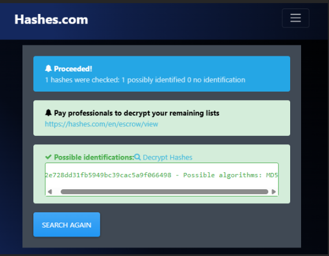

---

## Cracking Basic Hashes (MD5)

Used wordlists to crack MD5 hash

john --format=raw-md5 --wordlist=/usr/share/wordlists/rockyou.txt hash1.txt
 

## Cracking Windows Hashes (NTLM)

Used John the Ripper to crack Windows authentication hashes.

john --format=nt --wordlist=/usr/share/wordlists/rockyou.txt ntlm.txt

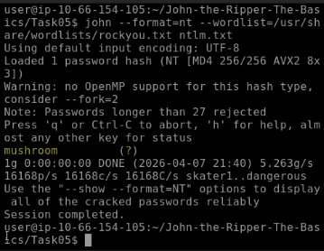

## Linux /etc/shadow Hashes

Combined passwd and shadow files and cracked SHA512 hashes.

unshadow local_passwd local_shadow > unshadowed.txt
john --wordlist=/usr/share/wordlists/rockyou.txt --format=sha512crypt unshadowed.txt

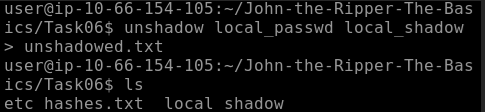

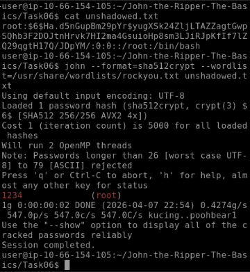

## Cracking ZIP & RAR Files

Converted ZIP file into a hash and cracked the password.

zip2john secure.zip > zip_hash.txt
john zip_hash.txt --wordlist=/usr/share/wordlists/rockyou.txt

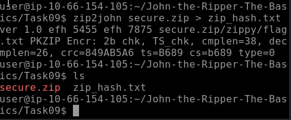

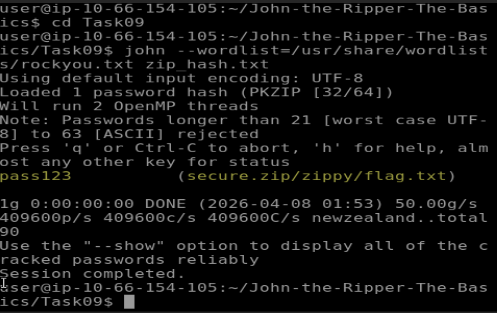

After cracking, the contents were extracted:

unzip secure.zip

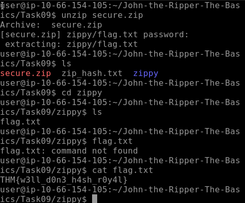

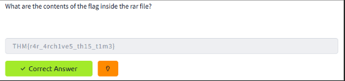

Converted RAR file into a hash and cracked the password.

rar2john secure.rar > rar_hash.txt
john rar_hash.txt --wordlist=/usr/share/wordlists/rockyou.txt

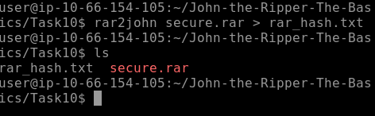

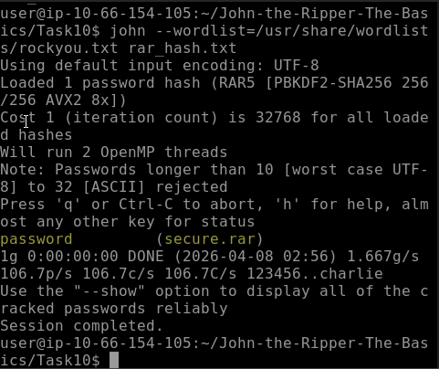

Extracted the contents after cracking:

unrar x secure.rar

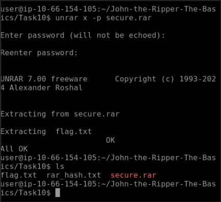

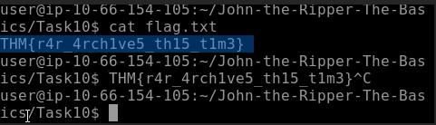

## Cracking SSH Keys

Converted SSH private key into a hash and cracked the password.

/opt/john/ssh2john.py id_rsa > id_rsa_hash.txt
john --wordlist=/usr/share/wordlists/rockyou.txt id_rsa_hash.txt

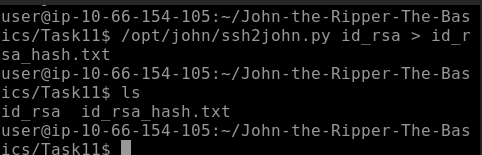

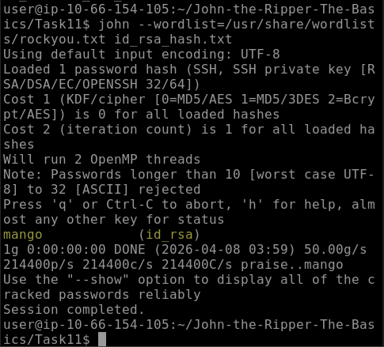

## Findings

Weak passwords were successfully cracked using common wordlists

Hash format identification is critical for successful cracking

Different file types require specific preprocessing tools

Common wordlists such as rockyou.txt remain highly effective against weak passwords.

## Challenges

Identifying correct hash formats

File path and syntax errors

Understanding preprocessing tools (zip2john, ssh2john)

## Lessons Learned

Importance of strong password policies

Risks of weak encryption and reused passwords

Value of proper hash identification and tool usage

